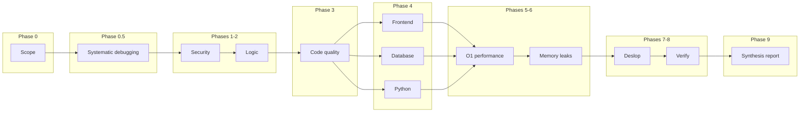

# Maestro

**One skill. Fourteen audit phases. One ship report.**

Maestro is a self-contained agent skill that orchestrates security, correctness, maintainability, domain-specific, performance, memory, and verification analysis—in **dependency order**—then synthesizes a single executive audit you can act on before release.

No plugin chain. No installing seven separate analyzer skills. `npx skills add XharvaK/maestro`, then invoke `/maestro`.

---

## Why Maestro exists

Shipping with AI assistance is fast. Shipping **safely** still needs discipline: security before micro-optimizations, root cause before fixes, evidence before “looks good.”

Maestro encodes that discipline as a **fixed pipeline** so you get repeatable pre-release audits instead of ad-hoc prompts that skip auth, forget edge cases, or optimize the wrong layer.

---

## How it works



**Iron Law (every track):**

```text
NO FIXES WITHOUT ROOT CAUSE INVESTIGATION FIRST
```

---

## Master phase table

| Phase | Module | Purpose | Run when | Full | Quick | Incident | IDs | Output |
|:-----:|--------|---------|----------|:----:|:-----:|:--------:|-----|--------|
| **0** | Scope | Target, runtime, trust boundaries, mode | Always | ✓ | ✓ | ✓ | — | `MAESTRO_SCOPE` |
| **0.5** | Systematic debugging | Root cause; Iron Law on all fixes | Always | ✓ | Iron Law | **full** | `P0.5-RC-n` | Root cause report |
| **1** | Security | Input, authn, authz, data protection | Always | ✓ | ✓ | ✓* | `P1-VULN-n` | `VULNERABILITY #n` |
| **2** | Logic | Flow, state, edges, errors | Always | ✓ | ✓ | ✓* | `P2-LOG-*` | Logical / State / Gap |
| **3** | Code quality | 1k-line rule, structure, code judo | Release | ✓ | — | opt | `P3-QA-n` | Maintainability findings |
| **4a** | Frontend | DOM, a11y, browsers, mobile | UI in scope | ✓ | — | if UI | `P4a-FE-n` | `ISSUE #n` |
| **4b** | Database | SQL, indexes, query plans | DB in scope | ✓ | — | if DB | `P4b-DB-n` | `OPTIMIZATION #n` |
| **4c** | Python | Pythonic patterns, stdlib, memory | `.py` in scope | ✓ | — | if Py | `P4c-*` | `PATTERN` / `OPTIMIZATION` |
| **5** | O(1) performance | Big-O, bottlenecks, hot paths | Always | ✓ | ✓ | ✓* | `P5-*` | Performance + roadmap |
| **6** | Memory leaks | Listeners, DOM, subscriptions | Session code | ✓ | — | if repro | `P6-LEAK-n` | `LEAK #n` |
| **7** | Deslop | AI slop on branch diff | Diff vs `main` | ✓ | — | — | `P7-SLOP-n` | Slop report |
| **8a** | Compiler | Build / typecheck | Build exists | ✓ | — | — | `P8a-*` | Build status |
| **8b** | Smoke tests | E2E smoke | Suite exists | ✓ | — | — | `P8b-*` | Test results |
| **8c** | Verify-this | Prove Critical/High claims | Falsifiable claim | ✓ | — | ✓ | `P8c-*` | VERIFIED / NOT VERIFIED / INCONCLUSIVE |
| **8d** | Control UI | Browser repro, screenshots | UI in scope | ✓ | — | if UI | `P8d-*` | Artifacts |
| **9** | **Synthesis** | Executive report + ship verdict | Always | ✓ | ✓ | ✓ | — | **Ship report** |

\* **Incident track:** Phase 0.5 runs the full 4-phase debugging process first; later phases only cover scope tied to the root cause unless you request a full release audit.

### Execution order

```text
0 → 0.5 → 1 → 2 → 3 → 4a? → 4b? → 4c? → 5 → 6? → 7? → 8a? → 8b? → 8c? → 8d? → 9
```

| Mode | Phases |
|------|--------|
| **Full** | All applicable phases above |
| **Quick** | `0 → 0.5 → 1 → 2 → 5 → 9` |
| **Incident** | `0 → 0.5 (full) → targeted phases → 9` |

---

## What's bundled inside

Maestro inlines every methodology in [`phases.md`](phases.md)—you do not need separate skills installed.

| Category | Built-in module |
|----------|-----------------|
| Discipline | Systematic debugging (Iron Law + 4 phases) |
| Safety | Security vulnerability analyzer |
| Correctness | Logical debugger |
| Structure | Thermo-nuclear code quality review |
| Domain | Frontend debug, database optimizer, Python analyzer |
| Performance | O(1) analyzer, memory leak detective |
| Hygiene | Deslop |
| Evidence | Compiler check, smoke tests, verify-this, control UI |

---

## Install

### Recommended (skills CLI)

```bash
npx skills add XharvaK/maestro
```

Installs to `~/.agents/skills/maestro` for Cursor, Antigravity, and other compatible agents.

### Manual install

```bash
git clone https://github.com/XharvaK/maestro.git
mkdir -p ~/.agents/skills
cp -r maestro ~/.agents/skills/maestro
```

On Windows (PowerShell):

```powershell
git clone https://github.com/XharvaK/maestro.git
New-Item -ItemType Directory -Force -Path "$env:USERPROFILE\.agents\skills"
Copy-Item -Recurse -Force maestro "$env:USERPROFILE\.agents\skills\maestro"
```

Restart Cursor or open a new Agent chat. Invoke with **`/maestro`** or ask for a **full audit**.

See [docs/INSTALL.md](docs/INSTALL.md) for troubleshooting and project-scoped install.

---

## Usage

### Full release audit

```text
/maestro full audit on js/community/chat.js and firestore.rules before beta deploy
```

### Quick audit (security + logic + hot paths)

```text
/maestro quick audit on js/core/data.js
```

Set in scope:

```text
AUDIT_MODE: quick
```

### Incident track

```text
/maestro incident: favorite toggle wrong after rapid clicks in js/ui/favorites.js
```

```text
TRACK: incident
KNOWN_ISSUE: [symptoms, repro, expected vs actual]
```

---

## Example output (Phase 9)

```markdown
# Maestro Audit — community chat

## Executive summary
**Verdict: Not ready.** Fix P1-VULN-1 (AuthZ) and P6-LEAK-1 (subscription leak) before ship.

## Recommended fix order
1. P1-VULN-1 — Firestore rules membership check
2. P6-LEAK-1 — dispose onSnapshot on panel close
3. P2-LOG-1 — rollback optimistic UI on write failure

## Verification results
| ID | Claim | Verdict |
|----|-------|---------|
| P8c-VERIFY-1 | Heap stable after 10 open/close | VERIFIED |
```

Full walkthrough: [`examples.md`](examples.md).

---

## Repository layout

```text
maestro/
├── README.md       ← you are here
├── CHANGELOG.md    ← release notes
├── SKILL.md        ← skill entry (orchestration + phase table)
├── phases.md       ← all phase methodologies (self-contained)
├── examples.md     ← sample audit
├── LICENSE
└── docs/
    └── INSTALL.md
```

---

## Design principles

1. **Order matters** — security and logic before perf; analysis before verification.
2. **Stable IDs** — every finding traceable (`P1-VULN-1`, `P6-LEAK-1`, …).
3. **Templates, not vibes** — each phase has a defined output shape in `phases.md`.
4. **One ship report** — Phase 9 rolls up severity, fix order, and checklist.
5. **Self-contained** — single folder to publish or share.

---

## Contributing

Issues and PRs welcome. Put deep methodology in `phases.md`. See [CONTRIBUTING.md](CONTRIBUTING.md).

---

## License

[MIT](LICENSE) — use, fork, and publish freely; attribution appreciated.

---

<p align="center">
  <strong>Maestro</strong> — conduct the audit. ship with evidence.
</p>
